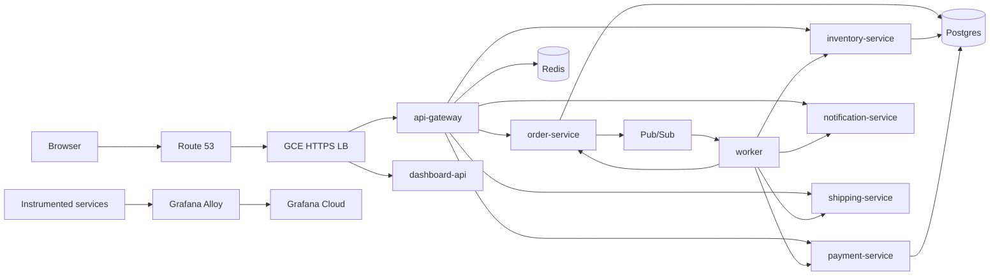

# Harbor Orders — Cloud-Native Order Platform on GKE

A production-shaped **order fulfillment platform** built as a first Kubernetes application: nine Go microservices on **GKE Autopilot**, event-driven orchestration over **Pub/Sub**, Terraform-managed GCP infrastructure, and hybrid observability (Cloud Monitoring + Grafana Cloud).

The shop UI and admin console sit behind per-environment HTTPS edges (`dev.order.mustafamirreh.com`, `staging.order…`, `prod.order…`) using GCE Ingress, a reserved global IP, Route 53 DNS, and Google Managed Certificates.

## Overview

| Concern | Approach |
|---------|----------|
| Runtime | GKE Autopilot (private nodes), Workload Identity |
| Apps | Go 1.22 services, Kustomize overlays per environment |
| Data | In-cluster Postgres + Redis (StatefulSets) for demo simplicity |
| Messaging | Pub/Sub topic + subscription + dead-letter topic |
| Edge | GCE Ingress, static global IP, ManagedCertificate, Route 53 A record |
| Secrets | Secret Manager → synced into the `orders` namespace |
| Observability | Cloud Monitoring alerts + OTel traces/metrics via Grafana Alloy → Grafana Cloud |
| IaC | Terraform modules + remote GCS state (`dev` / `staging` / `prod`) |

**What this demonstrates:** multi-service design, async workflows, private-cluster networking (Cloud NAT egress), cross-cloud DNS, SRE-oriented dashboards (golden signals / RED / SLOs), and a repeatable `make up` → `make deploy` path.



## Services

| Service | Role |
|---------|------|
| **api-gateway** | JWT auth, Redis rate limiting, reverse proxy to internal services |
| **order-service** | Order lifecycle / state machine; publishes domain events |
| **inventory-service** | Stock levels and reservations |
| **payment-service** | Charges, refunds, simple ledger |
| **notification-service** | Email / SMS dispatch hooks |
| **shipping-service** | Shipments, tracking, carrier webhook stubs |
| **worker** | Pub/Sub consumer; orchestrates cross-service side effects |
| **scheduler** | Cron-style jobs (expired reservations, abandoned orders, retries) |
| **dashboard-api** | Customer shop (`/`) and admin console (`/admin/`) |

Locally, events use **LocalStack SQS** as a stand-in; on GKE the same flow uses **Pub/Sub**.

## Infrastructure

Terraform lives under `terraform/environments/{dev,staging,prod}` and shared modules:

| Module / resource | Purpose |
|-------------------|---------|
| **network** | VPC, subnet, secondary ranges (pods/services), Cloud Router + **Cloud NAT** |
| **gke_autopilot** | Private Autopilot cluster, Workload Identity pool, authorized networks |
| **artifact_registry** | Private container images |
| **pubsub** | `order-events` topic, worker subscription, DLQ |
| **workload_identity** | GSAs for publisher / worker bound to K8s SAs |
| **secret_manager** | Postgres password, JWT secret, optional Grafana OTLP creds |
| **ingress_endpoint** | Global static IP + Route 53 A record (when `domain_name` is set) |
| **observability_gcp** | Email channel, ERROR log metric, HTTPS uptime check, alert policies |

Kubernetes manifests use **Kustomize** (`k8s/base` + overlays). Deploy renders Ingress / ManagedCertificate templates and optionally includes Grafana Alloy when Grafana credentials exist.

**Observability model**

- **GCP:** cluster/pod/LB metrics, structured logs, uptime + ERROR volume alerts  
- **Grafana Cloud:** OpenTelemetry traces + span-derived RED metrics via in-cluster Alloy  
- Dashboards (golden signals, RED, SLO/error budget): [`grafana/`](grafana/)

Details: [docs/observability.md](docs/observability.md).

## Repository layout

```text
├── services/                 # Go microservices
├── docker-compose.yml        # Local stack (Postgres, Redis, LocalStack, all services)
├── k8s/                      # Base + committed env overlays (Kustomize, GitOps)
├── gitops/                   # Argo CD app-of-apps, AppProject, bootstrap
├── .github/workflows/        # app-ci, infra-ci, drift-detection
├── terraform/                # Modules + env roots (remote state in GCS)
├── migrations/               # Ordered SQL (PreSync Job)
├── policy/                   # Conftest/OPA workload policies
├── grafana/                  # SRE dashboard JSON + import notes
├── scripts/                  # Smoke tests, LocalStack init, Argo bootstrap
├── docs/                     # deploy, observability, versioning, promotion, …
└── Makefile                  # Local convenience (plan-gated up/down, smoke)
```

## Local setup

**Prerequisites:** Docker Desktop (or compatible engine).

```bash
docker compose up --build
```

| Surface | URL |
|---------|-----|
| API gateway | http://localhost:8080 |
| Shop / admin UI | http://localhost:8086 |
| Postgres | `localhost:5432` (`app` / `localdev` / db `orders`) |
| Redis | `localhost:6379` |
| LocalStack | http://localhost:4566 |

Smoke containers (linux/amd64 health checks):

```bash
make smoke
```

## Deploy to GKE

**Prerequisites:** Terraform ≥ 1.5, `gcloud`, `kubectl`, Docker; a billed GCP project. For a custom domain on Route 53, AWS credentials must be available to Terraform (`aws login` / SSO as needed).

Full reference: [docs/deploy.md](docs/deploy.md).

### One-time state bucket

```bash
gcloud storage buckets create gs://muzzy-gke --location=europe-west2 --uniform-bucket-level-access
gcloud storage buckets update gs://muzzy-gke --versioning
```

Prefixes: `env/dev`, `env/staging`, `env/prod`.

### Environment bootstrap

```bash
ENV=dev

cp terraform/environments/$ENV/backend.hcl.example terraform/environments/$ENV/backend.hcl
cp terraform/environments/$ENV/terraform.tfvars.example terraform/environments/$ENV/terraform.tfvars
# Set project_id, region, domain_name / route53_zone_id, alert_email, optional grafana_*
```

### Apply infrastructure and sync apps

```bash
make init ENV=$ENV
make up ENV=$ENV           # plan-gated Terraform apply
make kubeconfig ENV=$ENV
# Argo CD: infra-ci bootstraps per env after apply; local:
#   scripts/bootstrap-argocd.sh $ENV
# UI: https://argocd.dev.order.mustafamirreh.com (Google login)
# Seed GSM before first bootstrap:
#   printf '%s' "$DEPLOY_KEY" | gcloud secrets versions add orders-argocd-repo-ssh-key --data-file=-
#   printf '%s' '{"clientID":"...","clientSecret":"..."}' | gcloud secrets versions add orders-argocd-google-oauth --data-file=-
# Ongoing: merge to main → app-ci → Argo CD reconciles k8s/overlays/$ENV
# Local convenience (skips CI supply chain): make build-push && make deploy
```


Image digests, promotion, and canaries: [docs/versioning.md](docs/versioning.md),
[docs/promotion.md](docs/promotion.md).

Verify:

```bash
make smoke-gke ENV=$ENV
curl -fsS https://dev.order.mustafamirreh.com/healthz   # when domain + cert are ready
```

Tear down (Ingress cleanup first, then destroy):

```bash
make down ENV=$ENV
# Or: Actions → infra-destroy (from main; confirm target; see docs/deploy.md)
```

## Design decisions

| Choice | Rationale |
|--------|-----------|
| **GKE Autopilot** | Pod-request billing, less node ops; suitable for a demo that still mirrors production habits |
| **Private nodes + Cloud NAT** | No public node IPs; controlled egress for OTLP / external HTTPS |
| **Workload Identity** | GCP API access without long-lived JSON keys in pods |
| **Pub/Sub + DLQ** | Decoupled fulfillment path with poison-message isolation |
| **Single GCE Ingress** | One HTTPS LB and ManagedCertificate instead of per-service `LoadBalancer` Services |
| **Route 53 for DNS** | Domain stays on AWS; Terraform owns the A record pointing at GCP |
| **In-cluster Postgres/Redis** | Fast to stand up for demos; would move to Cloud SQL / Memorystore for production HA |
| **Hybrid observability** | Cheap/native infra signals in GCP; app traces and SRE dashboards in Grafana Cloud |
| **Remote Terraform state** | Shared GCS backend with environment prefixes for isolation |
| **GitOps + WIF CI** | Keyless GitHub→GCP; digests in git; Argo CD reconciles; Binary Auth dry-run→enforce |

## License

Private / presentation use unless otherwise noted.
